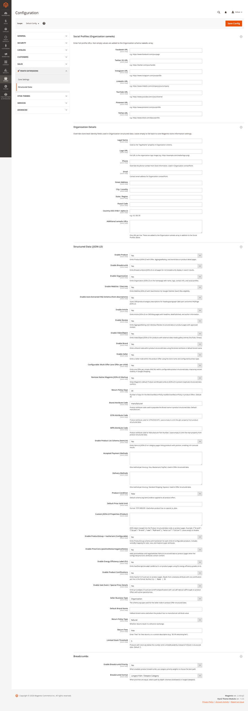

<!-- SEO Meta -->
<!--
  Title: Panth Structured Data — JSON-LD for Magento 2 (Hyva + Luma) | Panth Infotech
  Description: Panth Structured Data emits schema.org JSON-LD for every page type in Magento 2 — Product / AggregateOffer / BreadcrumbList / Organization / WebSite / ItemList / Review / FAQPage / Article / VideoObject / MerchantReturnPolicy. Full product-type coverage (simple / configurable / bundle / grouped), strips Magento's native markup to avoid duplicates, auto-extracts FAQ pairs, supports Pros/Cons, Energy Label, Certifications, Sale Event, Multi-Region Shipping, and the full Organization sameAs stack. Theme-agnostic — identical output on Hyva and Luma. Compatible with Magento 2.4.4 - 2.4.8, PHP 8.1 - 8.4.
  Keywords: magento 2 structured data, magento 2 json-ld, magento 2 schema.org, magento 2 rich results, magento 2 product schema, magento 2 breadcrumb schema, magento 2 organization schema, magento 2 aggregateoffer, magento 2 faqpage schema, hyva structured data, luma structured data, magento google rich results, panth structured data
  Author: Kishan Savaliya (Panth Infotech)
  Canonical: https://github.com/mage2sk/module-structured-data
-->

# Panth Structured Data — JSON-LD for Magento 2 (Hyva + Luma) | Panth Infotech

[](https://magento.com)
[](https://php.net)
[](https://www.hyva.io)
[]()
[](https://packagist.org/packages/mage2kishan/module-structured-data)
[](https://github.com/mage2sk/module-structured-data)
[](https://www.upwork.com/freelancers/~016dd1767321100e21)
[](https://kishansavaliya.com)

> **One JSON-LD block per page, product-type aware, theme-agnostic.** Panth Structured Data emits a single `<script type="application/ld+json">` with a deduplicated `@graph` covering every schema.org node Google cares about — Product, Offer / AggregateOffer, BreadcrumbList, Organization, WebSite + SearchAction, ItemList, Review + AggregateRating, FAQPage, Article, VideoObject, MerchantReturnPolicy — with automatic strip of Magento's native duplicate markup. Identical output on Hyva and Luma, zero theme overrides.

**Panth Structured Data** is a production-grade schema.org JSON-LD module for Magento 2. A single head block feeds a pipeline of 24 content providers that each contribute one or more nodes to a shared `@graph` which an `Aggregator` deduplicates by `@id` and deep-merges so two providers contributing to the same entity always produce a single coherent node. A plugin on `AbstractBlock::afterToHtml` strips Magento's native `application/ld+json` scripts from `product.info.main`, `breadcrumbs` and `product.price.final` so you never ship two versions of the same schema. Every toggle, attribute code, and social URL lives under **Admin → Stores → Configuration → Panth Extensions → Structured Data** — nothing runs unless it's applicable on the current page.

Full product-type coverage: **simple** products emit `Product + Offer`, **configurable** emits `Product + AggregateOffer` with one child `Offer` per variant (15 variants → 15 offers), **bundle** emits `Product + AggregateOffer` with `lowPrice` / `highPrice` from the bundle price range, **grouped** emits `Product + AggregateOffer` with one child `Offer` per grouped SKU. Across all variant types the shared offer-level extras (`itemCondition`, `seller @id → #organization`, `priceValidUntil`, `shippingDetails`, `hasMerchantReturnPolicy`) ride through the deep-merge so rich-result validators always see a complete Offer.

---

## 🚀 Need Custom Magento 2 Development?

> **Get a free quote for your project in 24 hours** — custom modules, Hyva themes, performance optimization, M1→M2 migrations, and Adobe Commerce Cloud.

<p align="center">
  <a href="https://kishansavaliya.com/get-quote">
    
  </a>
</p>

<table>
<tr>
<td width="50%" align="center">

### 🏆 Kishan Savaliya
**Top Rated Plus on Upwork**

[](https://www.upwork.com/freelancers/~016dd1767321100e21)

100% Job Success • 10+ Years Magento Experience
Adobe Certified • Hyva Specialist

</td>
<td width="50%" align="center">

### 🏢 Panth Infotech Agency
**Magento Development Team**

[](https://www.upwork.com/agencies/1881421506131960778/)

Custom Modules • Theme Design • Migrations
Performance • SEO • Adobe Commerce Cloud

</td>
</tr>
</table>

**Visit our website:** [kishansavaliya.com](https://kishansavaliya.com) &nbsp;|&nbsp; **Get a quote:** [kishansavaliya.com/get-quote](https://kishansavaliya.com/get-quote)

---

## Table of Contents

- [Admin Preview](#admin-preview)
- [Key Features](#key-features)
- [How It Works](#how-it-works)
- [Schema.org Nodes Emitted](#schemaorg-nodes-emitted)
- [Product Type Coverage](#product-type-coverage)
- [Compatibility](#compatibility)
- [Installation](#installation)
- [Configuration](#configuration)
- [Quick Test — URLs You Can Hit Right Now](#quick-test--urls-you-can-hit-right-now)
- [How to Validate with Google Search Console (Step by Step)](#how-to-validate-with-google-search-console-step-by-step)
- [Other Validators](#other-validators)
- [Per-Provider Deep Dive](#per-provider-deep-dive)
- [Troubleshooting](#troubleshooting)
- [FAQ](#faq)
- [Support](#support)
- [About Panth Infotech](#about-panth-infotech)

---

## Admin Preview

**Stores → Configuration → Panth Extensions → Structured Data** carries the full configuration surface — Social Profiles (Organization `sameAs`), Organization Details, Structured Data toggles (JSON-LD), and Breadcrumbs. Every field is `[store view]`-scoped so a multi-store install can ship a different schema per storefront.



---

## Key Features

### One Block, One Graph, Zero Duplicates

- **Single `<script type="application/ld+json" data-panth-seo="jsonld">`** per page. Everything the module knows about the current entity lives inside one `@graph`.
- **Aggregator** deduplicates by `@id` and **deep-merges** so the Product node emitted by `ProductProvider` and the AggregateOffer from `ConfigurableOfferProvider` become one coherent Product with one Offer, no collisions.
- **Native-markup strip plugin** removes Magento's built-in `application/ld+json` from `product.info.main`, `breadcrumbs`, `product.price.final` plus all `itemprop` / `itemscope` / `itemtype` microdata attributes on those blocks — so you never ship two Product schemas.
- **Own blocks are explicitly skipped** — scripts carrying `data-panth-seo` are preserved.

### Full Product Type Coverage

- **Simple** → `Product` + scalar `Offer` (price / availability / itemCondition / seller / priceValidUntil / shippingDetails).
- **Configurable** → `Product` + `AggregateOffer` (`lowPrice` / `highPrice` / `offerCount`) with one child `Offer` per visible variant, each carrying its own price / sku / availability / url.
- **Bundle** → `Product` + `AggregateOffer` with `lowPrice` / `highPrice` pulled from the bundle option price range. Fixed-price bundles get a single `Offer` with the fixed final price.
- **Grouped** → `Product` + `AggregateOffer` with one child `Offer` per grouped SKU (name / price / availability / sku / url).
- **Virtual / Downloadable** → treated like simple products — `Product` + `Offer`.
- **ProductGroup + hasVariant** (optional, opt-in) → richer variant modelling via `ProductGroup` + `variesBy` on `color` / `size` / `material`.

### Identity Nodes

- **Organization** — name / url / logo / legalName / contactPoint (phone + email) / PostalAddress / `sameAs` array merging the 7 dedicated social-profile fields (Facebook, Twitter/X, Instagram, LinkedIn, YouTube, Pinterest, TikTok) with a free-form textarea for anything else.
- **WebSite** — with `SearchAction` for Google Sitelinks Search Box eligibility.
- **Seller** — auto-merged into `#organization` by default (since `business_type = Organization`); switches the `@type` to `LocalBusiness` / `Store` / `OnlineStore` when configured.

### Content-Rich Nodes

- **BreadcrumbList** — full category hierarchy for products (Home → Gear → Bags → Product), not just Home + Product. Respects admin-configured category priority weights when enabled.
- **ItemList** — on category pages, listing products with `position` for rich carousel results.
- **Review** + **AggregateRating** — top-N approved reviews with ISO 8601 `datePublished`, scaled 1-5 rating from Magento's 0-100 percent votes.
- **FAQPage** — auto-extracted `Question` / `acceptedAnswer` pairs from product / category / CMS descriptions. Recognises `<h2>…?</h2><p>…</p>` and `<h3>…?</h3><p>…</p>` patterns.
- **Article** — for CMS pages under `blog/*`, `news/*`, `articles/*` or carrying `article` in their meta keywords.
- **VideoObject** — for product media gallery entries of type `external-video` (YouTube / Vimeo).

### Merchant / Pricing Extras

- **MerchantReturnPolicy** — `applicableCountry` (ISO 3166-1), `merchantReturnDays` (int), `returnMethod`, `returnFees` (properly mapped to the schema.org `ReturnFeesEnumeration` URL).
- **Product** pricing: `priceValidUntil` from product `special_to_date` → admin default → auto +1 year fallback; `availability` from `isSalable()` / `StockRegistry` with LimitedAvailability / BackOrder / PreOrder / Discontinued beyond InStock / OutOfStock.
- **Sale Event** (opt-in) — `priceSpecification` with `validFrom` / `validThrough` on products with active special prices.
- **Delivery Methods** — structured shipping details from admin-listed methods.
- **Payment Methods** — `acceptedPaymentMethod` in Offer from admin list.
- **Multi-Region Shipping** (auto-detect) — reads Magento's table-rate / flat-rate config and emits `shippingDetails` per region. Only when admin hasn't configured manual `delivery_methods`.

### Specialist Nodes

- **Brand** — standalone Brand node using the configured product attribute (default `manufacturer`) + admin-configurable default fallback brand.
- **Certifications** — `hasCertification` from a textarea attribute in `Authority | Name | ID` format.
- **Energy Efficiency Label (EU)** — `hasEnergyConsumptionDetails` with grades A–G.
- **Pros / Cons** — `positiveNotes` / `negativeNotes` ItemLists from textarea attributes.
- **Custom Properties** — admin-configurable JSON object deep-merged into the Product node for anything beyond the built-in schemas (e.g. `material`, `audience`, custom-vocabulary facets).

### Production-Grade Implementation

- **Theme-agnostic** — head block attached to `head.additional` via `view/frontend/layout/default.xml`. No JS, no RequireJS, no `x-magento-init`. Identical output on Hyva, Luma, Breeze, and every custom theme.
- **Fully cacheable** — the head block is `cacheable="true"`, so FPC bakes the JSON-LD alongside the rest of the `<head>` and the providers only run on uncached renders.
- **ISO 8601 dates everywhere** — product `dateModified` / `datePublished`, review `datePublished`, article dates, sale `validFrom`/`validThrough` all go through `DateTimeImmutable::format(ATOM)` for strict schema.org compliance.
- **Attribute-text coerced** — `getAttributeText()` return values (string | array | false | null from multi-select attributes) are normalised before use, preventing a single multi-select attribute from silently killing the entire Product node.
- **XSS-safe JSON payload** — every `</` inside the JSON is escaped to `<\/` so browsers can't be tricked into closing the `<script>` tag early.

---

## How It Works

The module is a pipeline: **admin config → providers → aggregator → head block → `<script>` tag**.

```
┌─────────────────────────────────────────────────────────────────────┐
│  Admin → Stores → Configuration → Panth Extensions → Structured Data│
│   (toggles, attribute codes, social URLs, organization fields)       │
└────────────────────────────────────┬────────────────────────────────┘
                                     │
                 Helper\Config reads every field
                                     ▼
┌─────────────────────────────────────────────────────────────────────┐
│  Aggregator (di.xml-registered pipeline of 24 providers)             │
│                                                                      │
│   OrganizationProvider  → Organization #organization                 │
│   WebsiteProvider       → WebSite #website (+ SearchAction)          │
│   BreadcrumbProvider    → BreadcrumbList                             │
│   ProductProvider       → Product #product + scalar Offer extras     │
│   FaqExtractor          → FAQPage (if Q&A pairs detected)            │
│   ReviewProvider        → Review[] (top 5 approved)                  │
│   VideoProvider         → VideoObject[] (external-video entries)     │
│   CmsArticleProvider    → Article (blog-like CMS pages)              │
│   ReturnPolicyProvider  → MerchantReturnPolicy                       │
│   BrandProvider         → Brand                                      │
│   ProductListProvider   → ItemList (category pages)                  │
│   PaymentMethodProvider → Offer (acceptedPaymentMethod)              │
│   DeliveryMethodProvider→ Offer (shippingDetails)                    │
│   MultiRegionShipping   → Offer (multi-region shippingDetails)       │
│   ConfigurableOffer     → Product #product → AggregateOffer          │
│   GroupedOffer          → Product #product → AggregateOffer (group)  │
│   BundleOffer           → Product #product → AggregateOffer (bundle) │
│   CustomProperties      → Product #product + merchant-defined JSON   │
│   EnergyLabel           → Product #product + hasEnergyConsumption    │
│   Certification         → Product #product + hasCertification        │
│   SaleEvent             → Product #product + priceSpecification      │
│   ProductGroup          → ProductGroup + hasVariant                  │
│   ProsCons              → Product #product + positiveNotes/negative  │
│   SellerProvider        → Organization #organization (merged)        │
└────────────────────────────────────┬────────────────────────────────┘
                                     │
                 Deep-merge by @id, deduplicate, validate
                                     ▼
┌─────────────────────────────────────────────────────────────────────┐
│  {"@context":"https://schema.org","@graph":[ ...merged nodes... ]}   │
│  JSON_UNESCAPED_SLASHES + JSON_UNESCAPED_UNICODE + `</` → `<\/`     │
└────────────────────────────────────┬────────────────────────────────┘
                                     │
                      Block\Head\StructuredData echoes inside:
                                     ▼
┌─────────────────────────────────────────────────────────────────────┐
│  <script type="application/ld+json" data-panth-seo="jsonld">         │
│    { ...full @graph... }                                             │
│  </script>                                                           │
│                                                                      │
│  RemoveNativeMarkupPlugin also runs on AbstractBlock::afterToHtml    │
│  and strips Magento's native ld+json + microdata from three blocks:  │
│     product.info.main, breadcrumbs, product.price.final              │
│  (own blocks carrying data-panth-seo are explicitly preserved)       │
└─────────────────────────────────────────────────────────────────────┘
```

### Six things the Aggregator does

1. **Applicability check** — every provider exposes `isApplicable()`. Product-scoped providers return `false` on CMS pages, `ReturnPolicyProvider` returns `false` when `return_policy_days = 0`, `FaqExtractor` defers to `Panth_Faq` when that module owns the current page. Providers that return `false` are skipped entirely.
2. **Config gate** — `Config::isStructuredDataEnabled($provider->getCode())` reads `panth_structured_data/structured_data/{code}`. Admin disables any provider with a single Yes/No toggle.
3. **Node collection** — applicable + enabled providers' `getJsonLd()` returns are collected. Single-node returns and list-of-nodes returns both work.
4. **Dedup + deep-merge** — two nodes with the same `@id` get merged key-by-key. Scalars from later providers win, arrays recurse, new keys get appended. Two providers contributing to the same Product, Organization, or Offer always produce one coherent node.
5. **Document shape** — one node in `@graph` → inline the node under `@context`. Multiple nodes → wrap in `@graph`.
6. **XSS safety** — every `</` in the serialised JSON is replaced with `<\/` so the `<script>` tag can never be closed early by a malicious product name.

### The deep-merge, concretely

Before merge (two separate provider outputs on a configurable PDP):

```json
// ProductProvider
{
  "@type": "Product",
  "@id": "https://example.com/hoodie.html#product",
  "name": "Chaz Kangeroo Hoodie",
  "offers": {
    "@type": "Offer",
    "itemCondition": "https://schema.org/NewCondition",
    "seller": {"@id": "https://example.com/#organization"},
    "priceValidUntil": "2027-04-23",
    "shippingDetails": { ... }
  }
}

// ConfigurableOfferProvider
{
  "@type": "Product",
  "@id": "https://example.com/hoodie.html#product",
  "offers": {
    "@type": "AggregateOffer",
    "lowPrice": "52.00",
    "highPrice": "52.00",
    "offerCount": 15,
    "priceCurrency": "USD",
    "offers": [ {...15 child offers...} ]
  }
}
```

After merge in `@graph`:

```json
{
  "@type": "Product",
  "@id": "https://example.com/hoodie.html#product",
  "name": "Chaz Kangeroo Hoodie",
  "offers": {
    "@type": "AggregateOffer",
    "lowPrice": "52.00",
    "highPrice": "52.00",
    "offerCount": 15,
    "priceCurrency": "USD",
    "itemCondition": "https://schema.org/NewCondition",
    "seller": {"@id": "https://example.com/#organization"},
    "priceValidUntil": "2027-04-23",
    "shippingDetails": { ... },
    "offers": [ {...15 child offers...} ]
  }
}
```

Scalar `@type` is overridden by the later `ConfigurableOfferProvider` (`"AggregateOffer"` wins). Every scalar key unique to one side is preserved. `shippingDetails` (nested array) comes through untouched from `ProductProvider`. `offers` (the child-offer array from `ConfigurableOfferProvider`) is added without conflict.

---

## Schema.org Nodes Emitted

| Node | @id pattern | When |
|---|---|---|
| `Organization` | `{store_url}#organization` | Every page |
| `WebSite` | `{store_url}#website` | Every page (toggle) |
| `BreadcrumbList` | `{store_url}#breadcrumb-{sha1 of path}` | Product, category, CMS (2+ items) |
| `Product` | `{product_url}#product` | Product pages |
| `Offer` / `AggregateOffer` | inline under `Product.offers` | Product pages (shape depends on type) |
| `Review` | no @id (list items) | Product pages with approved reviews |
| `AggregateRating` | inline under `Product.aggregateRating` | Product pages with votes |
| `MerchantReturnPolicy` | no @id | Product pages when `return_policy_days > 0` |
| `FAQPage` | `{store_url}#faq-{sha1 of path}` | Any page with ≥2 Q&A pairs in description |
| `Article` | `{page_url}#article` | Blog-like CMS pages |
| `VideoObject` | no @id (list items) | Product pages with external-video gallery entries |
| `ItemList` | `{category_url}#productlist` | Category pages with products |
| `Brand` | inline under `Product.brand` | Product pages when brand attribute has value |
| `ProductGroup` | `{parent_url}#productgroup` | Configurable products (opt-in) |

All URL-valued attributes (`og:url`, `url`, `image`, `logo`, `sameAs`) preserve `:` and `/` (no entity-encoding). All dates are ISO 8601 (`YYYY-MM-DDTHH:MM:SS+00:00`). All enumerations (`availability`, `itemCondition`, `returnFees`, `returnPolicyCategory`, `returnMethod`) are full schema.org URLs.

---

## Product Type Coverage

Tested end-to-end across Magento's sample catalogue on both Hyva and Luma:

| Type | Sample SKU | Sample URL | `Product.offers.@type` | Notes |
|---|---|---|---|---|
| Simple | `24-WB02` | `/compete-track-tote.html` | `Offer` | price, availability, itemCondition, seller, priceValidUntil, shippingDetails |
| Configurable | `MH01` | `/chaz-kangeroo-hoodie.html` | `AggregateOffer` | 15 child Offers (one per variant), lowPrice / highPrice / offerCount |
| Bundle (dynamic) | `24-WG080` | `/sprite-yoga-companion-kit.html` | `AggregateOffer` | lowPrice / highPrice from bundle option range, offerCount = 1 |
| Bundle (fixed) | any fixed-price bundle | — | `Offer` | single Offer with fixed final price |
| Grouped | `24-WG085_Group` | `/set-of-sprite-yoga-straps.html` | `AggregateOffer` | 3 child Offers (one per grouped SKU) |
| Virtual | any virtual product | — | `Offer` | same as simple |
| Downloadable | any downloadable product | — | `Offer` | same as simple |

Across all variant types the shared offer-level extras (`itemCondition`, `seller @id`, `priceValidUntil`, `shippingDetails`) merge into the `AggregateOffer` via the deep-merge path, so a bundle / grouped / configurable product still carries its return policy and product condition on the Offer node.

---

## Compatibility

| Requirement | Versions Supported |
|---|---|
| Magento Open Source | 2.4.4, 2.4.5, 2.4.6, 2.4.7, 2.4.8 |
| Adobe Commerce | 2.4.4, 2.4.5, 2.4.6, 2.4.7, 2.4.8 |
| Adobe Commerce Cloud | 2.4.4 — 2.4.8 |
| PHP | 8.1.x, 8.2.x, 8.3.x, 8.4.x |
| MySQL | 8.0+ |
| MariaDB | 10.4+ |
| Hyva Theme | 1.0+ (native support) |
| Luma Theme | Native support |
| Required Dependency | `mage2kishan/module-core` ^1.0 |

Works standalone (no other Panth module needed) and composes cleanly with `Panth_AdvancedSEO`, `Panth_Faq`, `Panth_Testimonials` when any of those are installed (specialist providers defer to those modules on their own routes).

---

## Installation

### Composer Installation (Recommended)

```bash
composer require mage2kishan/module-structured-data
bin/magento module:enable Panth_Core Panth_StructuredData
bin/magento setup:upgrade
bin/magento setup:di:compile
bin/magento setup:static-content:deploy -f
bin/magento cache:flush
```

### Manual Installation via ZIP

1. Download the latest release ZIP from [Packagist](https://packagist.org/packages/mage2kishan/module-structured-data) or the [Adobe Commerce Marketplace](https://commercemarketplace.adobe.com).
2. Extract the contents to `app/code/Panth/StructuredData/` in your Magento installation.
3. Ensure `Panth_Core` is installed (required dependency).
4. Run the same commands as above starting from `bin/magento module:enable`.

### Verify Installation

```bash
bin/magento module:status Panth_StructuredData
# Expected output: Module is enabled

# Every page now carries one JSON-LD block:
curl -ks https://your-store.test/ | grep -c 'application/ld+json'
# Expected output: 1
```

---

## Configuration

Navigate to **Admin → Stores → Configuration → Panth Extensions → Structured Data**. Four fieldsets:

### Social Profiles (Organization `sameAs`)

| Field | Purpose |
|---|---|
| Facebook URL | Full `https://www.facebook.com/yourpage` URL added to `sameAs` |
| Twitter (X) URL | Full `https://twitter.com/yourhandle` URL |
| Instagram URL | Full Instagram profile URL |
| LinkedIn URL | Full LinkedIn company-page URL |
| YouTube URL | Full YouTube channel URL |
| Pinterest URL | Full Pinterest profile URL |
| TikTok URL | Full TikTok profile URL |

All URLs validated against `validate-url` and the module's internal HTTPS-only allowlist before being emitted.

### Organization Details

| Field | Purpose |
|---|---|
| Legal Name | `legalName` on the Organization node |
| Logo URL | `logo` (ImageObject) |
| Phone | `contactPoint.telephone` — overrides `general/store_information/phone` |
| Email | `contactPoint.email` |
| Street / City / Region / Postal Code | Full `PostalAddress` |
| Country (ISO 3166-1 alpha-2) | `addressCountry` — e.g. `US`, `GB`, `DE` |
| Additional `sameAs` URLs | One URL per line — appended to the social-profile `sameAs` array |

Leave empty to fall back to core Magento Store Information.

### Structured Data (JSON-LD)

Master toggles + attribute codes + defaults. Every toggle is Yes/No, every attribute code is a plain Magento attribute identifier.

| Setting | Default | What it controls |
|---|---|---|
| Enable Product | Yes | Emits `Product` + `Offer` on product pages |
| Enable Breadcrumb | Yes | Emits `BreadcrumbList` everywhere |
| Enable Organization | Yes | Emits `Organization` on every page |
| Enable WebSite / SiteLinks | Yes | Emits `WebSite` + `SearchAction` |
| Enable Auto-Extracted FAQ Schema | Yes | Scans descriptions for Q&A pairs |
| Enable Article | Yes | Emits `Article` on blog-like CMS pages |
| Enable Review | Yes | Emits `Review` + `AggregateRating` |
| Enable VideoObject | Yes | Emits `VideoObject` for external-video gallery entries |
| Enable Brand | Yes | Emits `Brand` node |
| Enable Seller | Yes | Emits Seller (merged into `#organization` by default) |
| Configurable: Multi-Offer | Yes | Emits one child `Offer` per configurable variant |
| Remove Native Magento JSON-LD Markup | Yes | Strips Magento's native ld+json on product / breadcrumb blocks |
| Return Policy Days | 30 | `merchantReturnDays` — set to 0 to disable the MerchantReturnPolicy node |
| Brand Attribute Code | `manufacturer` | Product attribute used for Brand name |
| GTIN Attribute Code | *(empty)* | Product attribute for `gtin` / `gtin13` / `ean` |
| MPN Attribute Code | *(empty)* | Product attribute for Manufacturer Part Number |
| Enable Product List Schema | Yes | `ItemList` on category pages |
| Accepted Payment Methods | *(empty)* | One method per line (Visa, Mastercard, PayPal) |
| Delivery Methods | *(empty)* | One method per line (Standard Shipping, Express) |
| Product Condition | New | `itemCondition` enum (New / Used / Refurbished / Damaged) |
| Default Price Valid Until | *(empty)* | `YYYY-MM-DD` — falls back to +1 year |
| Custom JSON-LD Properties (Product) | *(empty)* | JSON object merged into the Product node |
| Enable ProductGroup + hasVariant | No | Emits `ProductGroup` with `variesBy` on color / size / material |
| Enable Pros/Cons | No | Emits `positiveNotes` / `negativeNotes` ItemLists |
| Pros Attribute Code | `product_pros` | Textarea attribute for pros |
| Cons Attribute Code | `product_cons` | Textarea attribute for cons |
| Enable Energy Efficiency Label (EU) | No | Emits `hasEnergyConsumptionDetails` |
| Energy Class Attribute Code | `energy_class` | Attribute for grades A–G |
| Enable Product Certifications | No | Emits `hasCertification` |
| Certification Attribute Code | `certifications` | Textarea, one `Authority \| Name \| ID` per line |
| Enable Sale Event / Special Price Details | Yes | Emits `priceSpecification` with `validFrom` / `validThrough` |
| Seller Business Type | Organization | `Organization` / `LocalBusiness` / `Store` / `OnlineStore` |
| Default Brand Name | *(empty)* | Fallback when product has no brand attribute |
| Return Policy Type | Refund | `refund` / `exchange` (as `additionalProperty`) |
| Return Fees | `free` | `free` / `ReturnFeesCustomerResponsibility` / `ReturnShippingFees` / `RestockingFees` |
| Limited Stock Threshold | 5 | Below this → `LimitedAvailability` instead of `InStock` |

### Breadcrumbs

| Setting | Default | What it controls |
|---|---|---|
| Enable Breadcrumb Priority | No | When Yes, product breadcrumbs use category priority weights |
| Breadcrumb Format | Longest (deepest) | `shortest` / `longest` — tiebreaker when priorities are equal |

Every field is `[store view]`-scoped.

After any change, flush caches:

```bash
bin/magento cache:flush config full_page
```

---

## Quick Test — URLs You Can Hit Right Now

Every URL below returns HTML with exactly one `<script type="application/ld+json" data-panth-seo="jsonld">…</script>` block. Substitute your own host for the domain.

### 1. View the JSON-LD in a browser

Open any URL → right-click → View Page Source → Ctrl-F for `application/ld+json`. The block carries the full `@graph`.

**Product types — Hyva + Luma test stores**

| Type | Hyva | Luma |
|---|---|---|
| Simple | `https://your-store.test/compete-track-tote.html` | `https://luma.your-store.test/compete-track-tote.html` |
| Configurable | `https://your-store.test/chaz-kangeroo-hoodie.html` | `https://luma.your-store.test/chaz-kangeroo-hoodie.html` |
| Bundle | `https://your-store.test/sprite-yoga-companion-kit.html` | `https://luma.your-store.test/sprite-yoga-companion-kit.html` |
| Grouped | `https://your-store.test/set-of-sprite-yoga-straps.html` | `https://luma.your-store.test/set-of-sprite-yoga-straps.html` |

**Other page types**

| Page | Hyva | Luma |
|---|---|---|
| Home | `https://your-store.test/` | `https://luma.your-store.test/` |
| Category (ItemList) | `https://your-store.test/gear/bags.html` | `https://luma.your-store.test/gear/bags.html` |
| CMS | `https://your-store.test/about-us` | `https://luma.your-store.test/about-us` |
| 404 | `https://your-store.test/no-route` | `https://luma.your-store.test/no-route` |
| Search | `https://your-store.test/catalogsearch/result/?q=bag` | `https://luma.your-store.test/catalogsearch/result/?q=bag` |

### 2. Pretty-print from the terminal

```bash
curl -ks https://your-store.test/chaz-kangeroo-hoodie.html \
  | perl -ne 'BEGIN{$/=undef} while (/<script type="application\/ld\+json"[^>]*>(.*?)<\/script>/gs) { print "$1\n" }' \
  | python3 -m json.tool
```

### 3. One-shot type summary across every page

```bash
for url in / /compete-track-tote.html /chaz-kangeroo-hoodie.html \
           /sprite-yoga-companion-kit.html /set-of-sprite-yoga-straps.html \
           /gear/bags.html /about-us /no-route; do
  types=$(curl -ks "https://your-store.test$url" \
    | perl -ne 'BEGIN{$/=undef} while (/<script type="application\/ld\+json"[^>]*>(.*?)<\/script>/gs) { print "$1\n" }' \
    | python3 -c 'import json,sys; d=json.loads(sys.stdin.read()); print(",".join(n.get("@type","?") for n in d.get("@graph",[d])))')
  printf "  %-40s %s\n" "$url" "$types"
done
```

Expected output on a stock sample-data install:

```
  /                                        Organization,WebSite
  /compete-track-tote.html                 Organization,WebSite,BreadcrumbList,Product,Review,MerchantReturnPolicy
  /chaz-kangeroo-hoodie.html               Organization,WebSite,BreadcrumbList,Product,MerchantReturnPolicy
  /sprite-yoga-companion-kit.html          Organization,WebSite,BreadcrumbList,Product,MerchantReturnPolicy
  /set-of-sprite-yoga-straps.html          Organization,WebSite,BreadcrumbList,Product,MerchantReturnPolicy
  /gear/bags.html                          Organization,WebSite,BreadcrumbList,ItemList
  /about-us                                Organization,WebSite
  /no-route                                Organization
```

### 4. Browser DevTools one-liner

Paste in Chrome / Firefox / Safari DevTools console on any page:

```js
JSON.parse(document.querySelector('script[data-panth-seo="jsonld"]').textContent)
  ['@graph'].forEach(n => console.log(n['@type'], '→', n.name || n.headline || n['@id']))
```

---

## How to Validate with Google Search Console (Step by Step)

Google's Rich Results Test is the authoritative validator — it's what determines whether your pages get rich cards in SERPs. Here's the full flow.

### Prerequisite: your site must be publicly reachable

Google's crawler can't reach `localhost`, `*.test`, VPN-internal, or intranet URLs. If you're testing locally, expose the site through a tunnel first:

```bash
# Option A: Cloudflare Tunnel (free, no signup for temporary tunnels)
cloudflared tunnel --url https://your-store.test

# Option B: ngrok (free tier fine for testing)
ngrok http https://your-store.test
```

Either gives you a public `https://xxxx.trycloudflare.com/` or `https://xxxx.ngrok.io/` URL. Use that in every validator below.

### Step 1 — Google Rich Results Test

1. Open [**search.google.com/test/rich-results**](https://search.google.com/test/rich-results).
2. Paste your full product URL (e.g. `https://xxxx.trycloudflare.com/compete-track-tote.html`).
3. Click **Test URL**. Google fetches the page.
4. Once it finishes, you'll see one or more "Detected items" — **Products**, **Breadcrumbs**, **Reviews**, **Merchant listings**, etc.
5. Click each item to expand. The left pane shows a live SERP preview card with your product image, price, rating stars, and availability.
6. Any errors or warnings show at the top of each item panel. **Errors** block rich results; **warnings** are suggestions.

**What to expect on a working product page:**

- ✅ Products — 1 item detected (valid)
- ✅ Breadcrumbs — 1 item detected (valid)
- ✅ Merchant listings — 1 item detected (valid) [if MerchantReturnPolicy enabled]
- ✅ Reviews — N items detected [if product has reviews]

### Step 2 — Submit your domain to Google Search Console

To track rich-result performance over time, add the whole site:

1. Open [**search.google.com/search-console**](https://search.google.com/search-console).
2. Click **Add property**.
3. Choose **Domain** (covers all subdomains + http/https) or **URL prefix** (for a specific scheme + host).
4. Follow the verification flow — DNS TXT record for a domain property, or HTML file upload / meta tag / Google Analytics / Google Tag Manager for URL prefix.
5. Once verified you'll see the **Overview** dashboard within 24 hours.

### Step 3 — Submit your sitemap

If you have `Panth_HtmlSitemap` or any other sitemap generator, submit it:

1. In Search Console → **Sitemaps** (left sidebar).
2. Paste the sitemap URL (e.g. `https://your-store.com/sitemap.xml`).
3. Click **Submit**. Google will crawl every URL in the sitemap and start detecting structured data.

### Step 4 — Monitor rich-result eligibility

After Google re-crawls (typically 1–7 days):

1. In Search Console → **Enhancements** (left sidebar).
2. You'll see separate reports for every rich-result type your site emits:
   - **Products** (from `Product` schema)
   - **Breadcrumbs** (from `BreadcrumbList` schema)
   - **Review snippets** (from `Review` + `AggregateRating`)
   - **Merchant listings** (from `Product` + `Offer` with price + availability + merchant return policy)
   - **Sitelinks searchbox** (from `WebSite` + `SearchAction`)
   - **FAQ** (from `FAQPage` schema)
   - **Logo** (from `Organization` + `logo`)
3. Each report shows **Valid** / **Valid with warnings** / **Invalid** URLs. Invalid URLs are the ones to fix first.

### Step 5 — Fix any invalid items

For each invalid URL:

1. Click the error type (e.g. "Missing field 'priceValidUntil'").
2. Review the list of affected URLs.
3. Open the URL in the Rich Results Test (Step 1) to see the exact problem.
4. Fix the admin config — e.g. populate **Default Price Valid Until** or the missing brand attribute.
5. Flush caches (`bin/magento cache:flush config full_page`).
6. In Search Console, click **Validate fix** on the error. Google will re-crawl within days.

### Step 6 — Request indexing (optional, speeds things up)

For a single URL:

1. In Search Console → **URL Inspection** (top search bar).
2. Paste a product URL.
3. Click **Request Indexing**.
4. Google will prioritize crawling that URL. Repeat for 10-20 of your most important pages.

### Step 7 — Confirm rich results in SERP

After Google re-indexes, search for your product in `site:your-store.com` mode:

```
site:your-store.com compete track tote
```

Rich snippets (price, stars, availability badges, breadcrumb path above the title) should appear. Full rollout across all indexed pages takes 2-8 weeks.

---

## Other Validators

Complement Google's Rich Results Test with these before shipping:

| Tool | What it checks | URL |
|---|---|---|
| **Schema.org Validator** | Stricter than Google — every schema.org issue, nested or not | [validator.schema.org](https://validator.schema.org/) |
| **Facebook Sharing Debugger** | Open Graph + schema.org for Facebook preview cards | [developers.facebook.com/tools/debug](https://developers.facebook.com/tools/debug/) |
| **LinkedIn Post Inspector** | Schema preview for LinkedIn shares | [linkedin.com/post-inspector](https://www.linkedin.com/post-inspector/) |
| **Bing Webmaster Tools — Markup Validator** | Bing's equivalent of Rich Results Test | [bing.com/webmasters/tools/markup-validator](https://www.bing.com/webmasters/tools/markup-validator) |
| **opengraph.xyz** | Multi-platform preview (Facebook, Twitter/X, LinkedIn, WhatsApp, Slack, iMessage, Discord) | [opengraph.xyz](https://www.opengraph.xyz/) |
| **Merkle Schema Markup Validator** | Batch-check multiple URLs | [technicalseo.com/tools/schema-markup-generator](https://technicalseo.com/tools/schema-markup-generator) |
| **Yandex Structured Data Validator** | Yandex-specific schema rules | [webmaster.yandex.com/tools/microtest](https://webmaster.yandex.com/tools/microtest/) |

---

## Per-Provider Deep Dive

### `ProductProvider`

- Runs on: product pages (`current_product` in registry).
- Emits: `Product` with `@id = {product_url}#product`, full image list (from Magento Image helper + media gallery), description (meta_description → short_description → description, ≤5000 chars), brand (via `Brand`), audience (via `PeopleAudience.audienceType` from `gender` attribute), scalar `Offer` for simple products or offer-level extras (itemCondition, seller, priceValidUntil, shippingDetails, hasMerchantReturnPolicy) for variant types, `AggregateRating` from Magento's review summary, ISO 8601 `dateModified` / `datePublished`.
- Availability logic: Discontinued (status=disabled or visibility=not_visible) → PreOrder (news_from_date in future) → BackOrder (backorders > 0) → OutOfStock → LimitedAvailability (qty < threshold) → InStock.
- Variant types (`configurable` / `bundle` / `grouped`) skip scalar `price` / `priceCurrency` / `availability` / `url` — the specialised provider contributes those via deep-merge.

### `ConfigurableOfferProvider`, `BundleOfferProvider`, `GroupedOfferProvider`

- Run on: configurable, bundle, grouped products respectively.
- Emit: a `Product #product` contribution containing an `AggregateOffer` with `lowPrice` / `highPrice` / `offerCount` and for Configurable / Grouped a child `offers` array of per-variant `Offer` nodes.
- Bundle dynamic pricing pulls min/max from the bundle option price range. Bundle fixed pricing emits a scalar `Offer`.
- All three merge into the same `#product` @id so the result is one coherent Product node.

### `OrganizationProvider` + `SellerProvider`

- Run on: every page (Organization) / product pages (Seller).
- Emit: `Organization #organization` with full identity details.
- `SellerProvider` uses the same `@id = #organization` by default; when `business_type = LocalBusiness / Store / OnlineStore` the merged `@type` is promoted to the more specific class.
- `sameAs` combines 7 dedicated social-profile fields with a free-form textarea.

### `BreadcrumbProvider`

- Runs on: any page with a clear entity (product / category / CMS).
- For products: picks the primary category from the product's category set, honoring admin-configured priority weights when `enable_breadcrumb_priority = Yes`, else tiebreaker on depth (longest / shortest).
- Builds full hierarchy: Home → Category → Subcategory → Product (4 levels on most PDPs).

### `ProductListProvider`

- Runs on: category pages only.
- Emits: `ItemList` with one `ListItem` per visible product in the current category view, preserving pagination order.

### `ReviewProvider`

- Runs on: product pages with reviews enabled (`catalog/review/active`).
- Emits: up to 5 most-recent approved `Review` nodes with ISO 8601 `datePublished`, scaled 1-5 rating from Magento's 0-100 percent vote aggregate.
- Defers to `Panth_Testimonials` on its own routes.

### `WebsiteProvider`

- Runs on: every page.
- Emits: `WebSite #website` with `SearchAction` pointing at `{store_url}catalogsearch/result/?q={search_term_string}` — enables Google Sitelinks Search Box.

### `FaqExtractor`

- Runs on: any page with a description containing heading/paragraph Q&A pairs.
- Parser: `<h2>…?</h2><p>…</p>` and `<h3>…?</h3><p>…</p>`.
- Needs ≥2 Q&A pairs; defers to `Panth_Faq` on its routes.

### `CmsArticleProvider`

- Runs on: CMS pages whose identifier starts with `blog/`, `news/`, `articles/` or whose meta keywords contain `article`.
- Emits: `Article` with headline / description / mainEntityOfPage / url / author / publisher refs + ISO 8601 `datePublished` / `dateModified` + up to 5000 chars of articleBody.

### `ReturnPolicyProvider`

- Runs on: product pages when `return_policy_days > 0`.
- Emits: `MerchantReturnPolicy` with `applicableCountry` from store config, `merchantReturnDays` (int), `returnMethod`, `returnFees` (mapped to `ReturnFeesEnumeration` URL).

### `VideoProvider`

- Runs on: product pages with media gallery entries of type `external-video`.
- Emits: `VideoObject` for each video (YouTube / Vimeo).

### Specialist providers

- `CertificationProvider` — `hasCertification` from a textarea attribute.
- `EnergyLabelProvider` — `hasEnergyConsumptionDetails` with grade A–G.
- `ProsConsProvider` — `positiveNotes` / `negativeNotes` ItemLists.
- `SaleEventProvider` — `priceSpecification` (UnitPriceSpecification) with validFrom/validThrough when special price is active.
- `DeliveryMethodProvider` / `PaymentMethodProvider` / `MultiRegionShippingProvider` — Offer extensions for shipping + payment.
- `ProductGroupProvider` — `ProductGroup` + `hasVariant` + `variesBy` (opt-in; richer variant modelling).
- `CustomPropertiesProvider` — admin-editable JSON object deep-merged into the Product node for anything outside the built-in schemas.
- `BrandProvider` — standalone Brand node alongside the inline `Product.brand`.

---

## Troubleshooting

| Issue | Cause | Resolution |
|---|---|---|
| No JSON-LD on any page | FPC cache from before install | `bin/magento cache:flush config full_page` |
| JSON-LD missing on specific page type | Provider's `isApplicable()` returned false | Check the provider's rules — e.g. `ItemList` needs a category with products; `FAQPage` needs ≥2 Q&A pairs |
| Duplicate Product schema in SERP | `remove_native_markup = No` | Flip to Yes + flush cache |
| `Breadcrumbs` only has 2 items (Home → Product) on PDPs with categories | Old versions (pre-1.0.1) had a missing Config constant | Upgrade to ≥ 1.0.1 |
| Multi-select `gender` or `brand` attr silently drops entire Product schema | Pre-1.0.2 `(string)` cast on array return | Upgrade to ≥ 1.0.2 |
| Configurable / bundle / grouped `offers` has leftover `price` key | Pre-1.0.2 ProductProvider didn't gate scalar pricing for variant types | Upgrade to ≥ 1.0.2 |
| Google Rich Results Test: "Either 'offers', 'review', or 'aggregateRating' should be specified" | Product has `$0.00` final price or is out-of-stock with stock-based logic | Set a price; check availability logic |
| Google: "Missing field 'priceValidUntil'" | No `special_to_date` and admin default empty | Set **Default Price Valid Until** to a future `YYYY-MM-DD` (module auto-falls-back to +1 year when both are empty) |
| Google: "Invalid URL in field 'image'" | Product has no image and store logo is a CDN URL that 404s | Upload a valid product image or store logo |
| Google: "Missing field 'returnFees'" | Pre-1.0.2 emitted free-text `returnFees` that didn't match `ReturnFeesEnumeration` | Upgrade to ≥ 1.0.2 |
| FAQPage not detected | Descriptions use a non-standard Q&A HTML shape | Use `<h2>Question?</h2><p>Answer.</p>` — needs ≥2 pairs |
| `SearchAction` points at wrong URL | Store base URL misconfigured | Fix **Stores → Configuration → Web → Base URLs** |
| Organization name renders as "Default Store View" | Store Information → Store Name not set | Set it under **Stores → Configuration → General → Store Information** |

---

## FAQ

### Will this slow down my storefront?

No. The head block is `cacheable="true"` so the full JSON-LD payload is baked into full-page cache. Providers only run on uncached renders; cached hits serve the pre-rendered `<script>` tag with zero PHP evaluation.

### Is it GDPR compliant?

The module only emits data already public on your storefront — product details, store identity, and aggregate review stats. It does not render personally identifiable data in structured-data form.

### Can I disable individual schemas?

Yes. Every provider has a **Yes/No** toggle under **Stores → Configuration → Panth Extensions → Structured Data** — Product, Breadcrumb, Organization, WebSite, FAQ, Article, Review, VideoObject, Brand, Seller, Product List (ItemList), ProductGroup, Pros/Cons, Energy Label, Certifications, Sale Event, Remove Native Markup.

### Does it work with Hyva?

Yes. No JS, no RequireJS, no `x-magento-init`. The head block attaches via `view/frontend/layout/default.xml` to the `head.additional` container which every Magento theme exposes. Identical output on Hyva, Luma, Breeze, and any custom theme.

### Does it support multi-store / multi-language?

Yes. Every admin field is `[store view]`-scoped, so different store views can ship different Organization data, social profiles, toggles, and attribute codes. URLs in the JSON-LD are scoped to the current store's base URL.

### Can I customize the emitted JSON?

Three ways, in increasing order of effort:

1. **Custom JSON-LD Properties (Product)** — admin field that accepts a JSON object; merged into the Product node on every PDP.
2. **Per-product EAV attributes** — the resolver reads product attributes like `meta_description`, `short_description`, `manufacturer`, `gender` — populate those for per-product overrides.
3. **Custom provider class** — implement `StructuredDataProviderInterface`, register in `di.xml` under the `providers` argument of `Panth\StructuredData\Model\StructuredData\Composite` (and `Aggregator`). The aggregator will pick it up automatically.

### Can I override a provider's output?

Yes — declare a virtualType in your own module's `di.xml` with the same class name as the provider you want to replace, or use a preference on `Panth\StructuredData\Api\StructuredDataProviderInterface` with a type constraint.

### Does it interact with `Panth_AdvancedSEO`, `Panth_Faq`, `Panth_Testimonials`?

Yes, friendly:

- `Panth_AdvancedSEO`: shares the `panth_seo/general/enabled` master switch when installed; defaults are set locally so standalone installs still work.
- `Panth_Faq`: `FaqExtractor` defers to `Panth_Faq` on its own routes and when the `faq.schema` block is mounted and producing data.
- `Panth_Testimonials`: `ReviewProvider` defers on the `testimonials` route when the module is enabled.

### Is `Panth_Core` required?

Yes. `mage2kishan/module-core` is a required dependency and is pulled in automatically by Composer.

### Does it emit `itemprop` / microdata?

No — only JSON-LD. Microdata is legacy and mixing the two often produces duplicate-structured-data warnings in Search Console. The `RemoveNativeMarkupPlugin` actively strips native Magento microdata from the target blocks.

### What's the smallest Magento version supported?

2.4.4. For earlier Magento versions, contact [Panth Infotech](https://kishansavaliya.com/get-quote) — we can backport on request.

---

## Support

| Channel | Contact |
|---|---|
| Email | kishansavaliyakb@gmail.com |
| Website | [kishansavaliya.com](https://kishansavaliya.com) |
| WhatsApp | +91 84012 70422 |
| GitHub Issues | [github.com/mage2sk/module-structured-data/issues](https://github.com/mage2sk/module-structured-data/issues) |
| Upwork (Top Rated Plus) | [Hire Kishan Savaliya](https://www.upwork.com/freelancers/~016dd1767321100e21) |
| Upwork Agency | [Panth Infotech](https://www.upwork.com/agencies/1881421506131960778/) |

Response time: 1-2 business days.

### 💼 Need Custom Magento Development?

Looking for **custom Magento module development**, **Hyva theme customization**, **store migrations**, or **performance optimization**? Get a free quote in 24 hours:

<p align="center">
  <a href="https://kishansavaliya.com/get-quote">
    
  </a>
</p>

<p align="center">
  <a href="https://www.upwork.com/freelancers/~016dd1767321100e21">
    
  </a>
  &nbsp;&nbsp;
  <a href="https://www.upwork.com/agencies/1881421506131960778/">
    
  </a>
  &nbsp;&nbsp;
  <a href="https://kishansavaliya.com">
    
  </a>
</p>

**Specializations:**

- 🛒 **Magento 2 Module Development** — custom extensions following MEQP standards
- 🎨 **Hyva Theme Development** — Alpine.js + Tailwind CSS, lightning-fast storefronts
- 🖌️ **Luma Theme Customization** — pixel-perfect designs, responsive layouts
- ⚡ **Performance Optimization** — Core Web Vitals, page speed, caching strategies
- 🔍 **Magento SEO** — structured data, hreflang, sitemaps, AI-generated meta
- 🛍️ **Checkout Optimization** — one-page checkout, conversion rate optimization
- 🚀 **M1 to M2 Migrations** — data migration, custom feature porting
- ☁️ **Adobe Commerce Cloud** — deployment, CI/CD, performance tuning
- 🔌 **Third-party Integrations** — payment gateways, ERP, CRM, marketing tools

---

## License

Panth Structured Data is licensed under a proprietary license — see `LICENSE.txt`. One license per Magento installation.

---

## About Panth Infotech

Built and maintained by **Kishan Savaliya** — [kishansavaliya.com](https://kishansavaliya.com) — a **Top Rated Plus** Magento developer on Upwork with 10+ years of eCommerce experience.

**Panth Infotech** is a Magento 2 development agency specializing in high-quality, security-focused extensions and themes for both Hyva and Luma storefronts. Our extension suite covers SEO, performance, checkout, product presentation, customer engagement, and store management — over 34 modules built to MEQP standards and tested across Magento 2.4.4 to 2.4.8.

Browse the full extension catalog on the [Adobe Commerce Marketplace](https://commercemarketplace.adobe.com) or [Packagist](https://packagist.org/packages/mage2kishan/).

### Quick Links

- 🌐 **Website:** [kishansavaliya.com](https://kishansavaliya.com)
- 💬 **Get a Quote:** [kishansavaliya.com/get-quote](https://kishansavaliya.com/get-quote)
- 👨‍💻 **Upwork Profile (Top Rated Plus):** [upwork.com/freelancers/~016dd1767321100e21](https://www.upwork.com/freelancers/~016dd1767321100e21)
- 🏢 **Upwork Agency:** [upwork.com/agencies/1881421506131960778](https://www.upwork.com/agencies/1881421506131960778/)
- 📦 **Packagist:** [packagist.org/packages/mage2kishan/module-structured-data](https://packagist.org/packages/mage2kishan/module-structured-data)
- 🐙 **GitHub:** [github.com/mage2sk/module-structured-data](https://github.com/mage2sk/module-structured-data)
- 🛒 **Adobe Marketplace:** [commercemarketplace.adobe.com](https://commercemarketplace.adobe.com)
- 📧 **Email:** kishansavaliyakb@gmail.com
- 📱 **WhatsApp:** +91 84012 70422

---

<p align="center">
  <strong>Ready to ship Google-validated structured data?</strong><br/>
  <a href="https://kishansavaliya.com/get-quote">
    
  </a>
</p>

---

**SEO Keywords:** magento 2 structured data, magento 2 json-ld, magento 2 schema.org, magento 2 rich results, magento 2 product schema, magento 2 aggregateoffer, magento 2 breadcrumb schema, magento 2 organization schema, magento 2 review schema, magento 2 faqpage, magento 2 article schema, magento 2 videoobject, magento 2 merchantreturnpolicy, magento 2 product list schema, magento 2 itemlist, magento 2 seo schema, magento 2 google rich results, magento 2 sitelinks searchbox, magento 2 productgroup hasvariant, magento 2 pros cons schema, magento 2 energy label schema, magento 2 certifications schema, magento 2 saleevent schema, magento 2 multi region shipping, magento 2 delivery method schema, magento 2 payment method schema, magento 2 configurable product schema, magento 2 bundle product schema, magento 2 grouped product schema, hyva structured data, hyva json-ld, luma structured data, luma schema, mage2kishan structured data, panth infotech structured data, kishan savaliya magento, magento 2.4.8 structured data, magento 2 PHP 8.4 structured data, hire magento developer upwork, top rated plus magento freelancer, custom magento development, adobe commerce structured data, magento rich snippets, magento seo extension, magento schema generator
