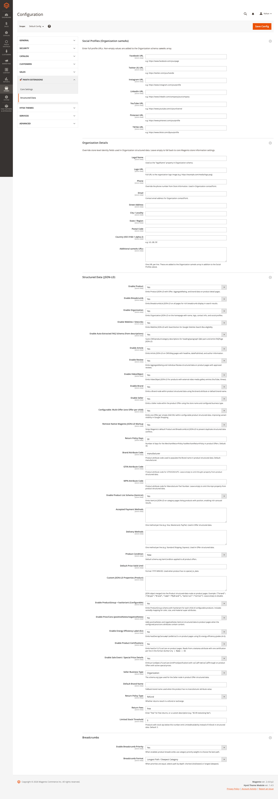

# Magento 2 Structured Data

Panth Structured Data (`Panth_StructuredData`) adds schema.org JSON-LD to the Magento 2 storefront. It covers product pages (Product, Offer or AggregateOffer, AggregateRating, Review, Brand, VideoObject and optional merchant, variant and label properties), category pages (ItemList, BreadcrumbList), CMS pages (WebPage or Article, BreadcrumbList, FAQPage) and site-wide nodes (Organization, WebSite with SearchAction). All nodes for a page are merged into a single `<script type="application/ld+json">` tag in the page head.

It is intended for merchants and developers who want structured data generated from catalog data and admin settings instead of hand-written markup. The block is added to the standard `head.additional` container with layout XML and uses no JavaScript, so it works on Luma, Hyva and other themes that render that container.

Product page: [kishansavaliya.com/magento-2-structured-data.html](https://kishansavaliya.com/magento-2-structured-data.html)



## Features

- One JSON-LD script tag per page. Nodes from all providers are collected, nodes with the same `@id` are deep-merged, nodes without an `@id` are kept separate, Offers and AggregateOffers without a price are removed, and the result is output as a single node or as an `@graph`.
- Product node with name, SKU, URL, images (base image plus gallery), description, `mpn`, `gtin`, `brand`, `audience`, `offers` and `aggregateRating`.
- SoftwareApplication instead of Product for products with "Is Software" set to Yes, with `applicationCategory`, `operatingSystem`, `publisher`, `dateModified`, `datePublished` and an Offer without shipping or return policy.
- Offer with price, currency, availability (InStock, LimitedAvailability, OutOfStock, BackOrder, PreOrder, Discontinued), `itemCondition`, `seller` and `priceValidUntil`.
- Optional inline `hasMerchantReturnPolicy` and `shippingDetails` on each Offer, configured in the admin. The shipping rate comes from the active Magento table rate or flat rate carrier when one is configured.
- AggregateOffer with one child Offer per enabled child product for configurable and grouped products, and a price range for dynamic-price bundles.
- Optional ProductGroup with `hasVariant` and `variesBy` for configurable products, output in place of the Product node.
- Review nodes from approved Magento product reviews and AggregateRating from the review summary.
- BreadcrumbList for product, category and CMS pages, with an optional category priority attribute to choose the category path of a product.
- ItemList of products on category pages only (never on product pages, even when a category is in the product URL).
- Organization with address, contact point, logo, founder reference and `sameAs` profile URLs; WebSite with SearchAction pointing to the catalog search results page.
- FAQPage extracted from question headings in product, CMS page and category descriptions.
- WebPage or Article on CMS pages and BlogPosting on Mageplaza, Magefan and Mirasvit Blog post pages.
- VideoObject for external videos in the product media gallery.
- Optional product properties: `hasCertification`, `hasEnergyConsumptionDetails`, `positiveNotes` / `negativeNotes`, custom JSON properties.
- Optional removal of Magento's own JSON-LD and microdata attributes from selected blocks to avoid duplicate markup.
- Adds a "Breadcrumb Priority" attribute to categories and "Is Software", "Software Application Category" and "Software Operating System" attributes to products.

## Compatibility

| Component | Supported |
|---|---|
| Magento Open Source | 2.4.4 to 2.4.8 |
| Adobe Commerce | 2.4.4 to 2.4.8 |
| PHP | 8.1, 8.2, 8.3, 8.4 |
| Themes | Luma, Hyva, and other themes that render the `head.additional` block |

Magento composer constraints: `magento/framework` ^103.0, `magento/module-store` ^101.1, `magento/module-catalog` ^104.0, `magento/module-catalog-inventory` ^100.4, `magento/module-configurable-product` ^100.4, `magento/module-bundle` ^101.0, `magento/module-grouped-product` ^100.4, `magento/module-offline-shipping` ^100.4, `magento/module-eav` ^102.1, `magento/module-cms` ^104.0, `magento/module-review` ^100.4, `magento/module-config` ^101.2.

## Requirements

- Magento 2.4.4 to 2.4.8 with PHP 8.1 to 8.4.
- `mage2kishan/module-core` ^1.0 (`Panth_Core`), installed automatically by Composer.

## Installation

```bash
composer require mage2kishan/module-structured-data
bin/magento module:enable Panth_Core Panth_StructuredData
bin/magento setup:upgrade
bin/magento setup:di:compile
bin/magento cache:flush
```

`setup:di:compile` is only required when the store runs in production mode. The module has no frontend static assets, so no static content deployment is needed for it.

Check that the module is enabled:

```bash
bin/magento module:status Panth_StructuredData
```

`setup:upgrade` runs three data patches: one adds the `breadcrumbs_priority` category attribute, one adds the `panth_is_software`, `panth_software_category` and `panth_software_os` product attributes, the other moves any existing values from the old `panth_seo/structured_data/`, `panth_seo/social_profiles/`, `panth_seo/organization/` and `panth_seo/breadcrumbs/` config paths to the `panth_structured_data/` paths.

## Configuration

Admin path: **Stores > Configuration > Panth Extensions > Structured Data**

All settings below can be set at default, website and store view scope. Config paths are `panth_structured_data/<group>/<field>`, where the group and field IDs are given with each table.

Output is also controlled by a master switch at `panth_seo/general/enabled` (default `1`) and a debug flag at `panth_seo/general/debug` (default `0`). This module does not add admin fields for these paths; when `mage2kishan/module-advanced-seo` is installed, its admin settings control the same paths. Without it they can be changed with `bin/magento config:set`. When the debug flag is on, validation issues found in the generated JSON-LD (missing required properties, invalid URLs) are written to the log.

### Social Profiles (Organization sameAs)

Group ID: `social_profiles`. Non-empty values that are valid http or https URLs are added to the Organization `sameAs` array.

| Setting | Default | What it does |
|---|---|---|
| Facebook URL (`facebook_url`) | empty | Facebook page URL |
| Twitter (X) URL (`twitter_url`) | empty | Twitter / X profile URL |
| Instagram URL (`instagram_url`) | empty | Instagram profile URL |
| LinkedIn URL (`linkedin_url`) | empty | LinkedIn page URL |
| YouTube URL (`youtube_url`) | empty | YouTube channel URL |
| Pinterest URL (`pinterest_url`) | empty | Pinterest profile URL |
| TikTok URL (`tiktok_url`) | empty | TikTok profile URL |

### Organization Details

Group ID: `organization`.

| Setting | Default | What it does |
|---|---|---|
| Legal Name (`legal_name`) | empty | `legalName` of the Organization |
| Logo URL (`logo`) | empty | Full URL of the logo image, output as an ImageObject |
| Phone (`phone`) | empty | ContactPoint telephone. When empty, the Store Information phone is used |
| Email (`email`) | empty | ContactPoint email (a `mailto:` prefix is removed) |
| Street Address (`street`) | empty | PostalAddress `streetAddress` |
| City / Locality (`locality`) | empty | PostalAddress `addressLocality` |
| State / Region (`region`) | empty | PostalAddress `addressRegion` |
| Postal Code (`postcode`) | empty | PostalAddress `postalCode` |
| Country (ISO 3166-1 alpha-2) (`country`) | empty | PostalAddress `addressCountry` |
| Additional sameAs URLs (`same_as`) | empty | One URL per line, added to `sameAs` together with the Social Profiles |
| Founder @id Reference (`founder_id`) | empty | Adds `founder` with this `@id`. A value that does not start with `http` is appended to the store base URL, for example `#founder` |

The Organization `name` comes from Stores > Configuration > General > Store Information (store name), falling back to the store view name.

### Structured Data (JSON-LD)

Group ID: `structured_data`.

| Setting | Default | What it does |
|---|---|---|
| Enable Product (`product`) | Yes | Product node on product pages. Also required for the bundle and grouped offer output |
| Enable Breadcrumb (`breadcrumb`) | Yes | BreadcrumbList on product, category and CMS pages |
| Enable Organization (`organization`) | Yes | Organization node on every page. Also required for the Seller output |
| Enable WebSite / SiteLinks (`website`) | Yes | WebSite node with SearchAction on every page |
| Enable Auto-Extracted FAQ Schema (from descriptions) (`faq`) | Yes | FAQPage built from question headings in descriptions |
| Enable Article (`article`) | Yes | WebPage or Article on CMS pages and BlogPosting on blog post pages |
| Enable Review (`review`) | Yes | Review nodes from approved product reviews |
| Enable VideoObject (`video`) | Yes | VideoObject for external videos in the product gallery |
| Enable Brand (`brand`) | Yes | Separate Brand node from the brand attribute or Default Brand Name |
| Enable Seller (`seller`) | Yes | On product pages, sets the Organization node type to the Seller Business Type; for Local Business and Store it adds the Store Information address and phone |
| Configurable: Multi-Offer (one Offer per child) (`configurable_multi_offer`) | Yes | AggregateOffer with child offers for configurable and grouped products, and bundle offers |
| Remove Native Magento JSON-LD Markup (`remove_native_markup`) | Yes | Removes other JSON-LD scripts and `itemscope` / `itemprop` / `itemtype` attributes from the `product.info.main`, `breadcrumbs` and `product.price.final` blocks |
| Return Policy Days (`return_policy_days`) | 30 | `merchantReturnDays` of the return policy |
| Brand Attribute Code (`brand_attribute`) | manufacturer | Product attribute used for the brand name |
| GTIN Attribute Code (`gtin_attribute`) | empty | Product attribute for `gtin`. When empty, the `gtin`, `gtin13` or `ean` product data is used if present |
| MPN Attribute Code (`mpn_attribute`) | empty | Product attribute for `mpn`. When empty, the `mpn` product data is used if present |
| Enable Product List Schema (ItemList) (`enable_product_list_schema`) | Yes | ItemList on category pages |
| Accepted Payment Methods (`accepted_payment_methods`) | empty | One method per line; see Usage for the recognised names |
| Delivery Methods (`delivery_methods`) | empty | One shipping option per line, output as `shippingDetails` on the Offer. Format `Label \| Transit Min \| Transit Max \| Cost` or `Label \| Handling Min \| Handling Max \| Transit Min \| Transit Max \| Cost` (days). Lines starting with `#` are ignored. Lines without handling days use Handling Time Min / Max |
| Product Condition (`product_condition`) | New | Offer `itemCondition`: New, Used, Refurbished or Damaged |
| Default Price Valid Until (`price_valid_until_default`) | empty | `priceValidUntil` (YYYY-MM-DD) when the product has no future `special_to_date`. When empty, one year from today is used |
| Custom JSON-LD Properties (Product) (`custom_properties`) | empty | JSON object merged into the Product node. Invalid JSON is logged and ignored |
| Enable ProductGroup + hasVariant (Configurable) (`product_group_enabled`) | No | ProductGroup node for configurable products |
| Enable Pros/Cons (positiveNotes/negativeNotes) (`pros_cons_enabled`) | No | Adds `positiveNotes` / `negativeNotes` to the Product |
| Pros Attribute Code (`pros_attribute`) | product_pros | Attribute with one pro per line. Shown when Pros/Cons is enabled |
| Cons Attribute Code (`cons_attribute`) | product_cons | Attribute with one con per line. Shown when Pros/Cons is enabled |
| Enable Energy Efficiency Label (EU) (`energy_label_enabled`) | No | Adds `hasEnergyConsumptionDetails` to the Product |
| Energy Class Attribute Code (`energy_class_attribute`) | energy_class | Attribute holding the grade. Shown when the energy label is enabled |
| Enable Product Certifications (`certification_enabled`) | No | Adds `hasCertification` to the Product |
| Certification Attribute Code (`certification_attribute`) | certifications | Attribute with one `Authority \| Name \| ID` entry per line. Shown when certifications are enabled |
| Enable Sale Event / Special Price Details (`sale_event_enabled`) | Yes | Special price `priceSpecification` on the product Offer and SaleEvent on category pages |
| Seller Business Type (`business_type`) | Organization | Organization, Local Business, Store or Online Store |
| Default Brand Name (`default_brand`) | empty | Brand name when the product has no brand attribute value |
| Return Policy Type (`return_policy_type`) | Refund | Refund or Exchange. Used by the standalone return policy node only |
| Return Fees (`return_policy_fees`) | free | `free` gives `FreeReturn`. `ReturnFeesCustomerResponsibility`, `ReturnShippingFees` and `RestockingFees` map to those values; any other text gives `ReturnFeesCustomerResponsibility` |
| Limited Stock Threshold (`limited_stock_threshold`) | 5 | Quantity below which a simple product offer shows `LimitedAvailability` |
| Enable Merchant Listing Offer Fields (`merchant_fields_enabled`) | Yes | Master switch for the inline return policy, inline shipping details and store name brand fallback |
| Emit Inline Return Policy (`merchant_return_enabled`) | Yes | Adds `hasMerchantReturnPolicy` to the Offer. Shown when merchant fields are enabled |
| Return Applicable Country (ISO 3166-1 alpha-2) (`return_applicable_country`) | empty | Return policy country. Empty uses `general/country/default` |
| Return Method (`return_method`) | Return by mail | Return by mail, Return in store or Return at kiosk. Used by the inline and the standalone return policy |
| Emit Inline Shipping Details (`merchant_shipping_enabled`) | Yes | Adds `shippingDetails` to the Offer. Delivery Methods lines replace these defaults when set; otherwise the active table rate or flat rate carrier sets the rate |
| Default Shipping Rate (`shipping_default_rate`) | 0 | Shipping rate value used when no table rate or flat rate carrier rate applies; 0 means free shipping |
| Handling Time Min (days) (`shipping_handling_min`) | 0 | Handling time minimum |
| Handling Time Max (days) (`shipping_handling_max`) | 1 | Handling time maximum |
| Transit Time Min (days) (`shipping_transit_min`) | 1 | Transit time minimum |
| Transit Time Max (days) (`shipping_transit_max`) | 5 | Transit time maximum |
| Shipping Destination Country (ISO 3166-1 alpha-2) (`shipping_country`) | empty | Shipping destination country. Empty uses `general/country/default` |
| Fall Back Brand to Store Name (`brand_use_store_name_fallback`) | Yes | Uses the Store Information name as brand when no other brand value exists |
| SoftwareApplication for Software Products (`software_application_enabled`) | Yes | Products with "Is Software" set to Yes are output as SoftwareApplication. Products without it are not affected |

The return and shipping sub-settings are shown only when their parent switches are set to Yes.

`config.xml` also sets `panth_structured_data/structured_data/multiRegionShipping` to `1`. This path has no admin field. When it is `1` and Delivery Methods is empty, the inline shipping rate is read from Magento carrier settings: an active table rate carrier first (the row for the configured condition whose threshold matches the product price, weight or a quantity of 1, one entry per destination country, region and postcode rows ignored), otherwise an active flat rate carrier price. The carrier title is used as `shippingLabel` and the rate is converted to the current store currency. Set it to `0` to always use Default Shipping Rate. No separate shipping Offer node is output.

### Breadcrumbs

Group ID: `breadcrumbs`.

| Setting | Default | What it does |
|---|---|---|
| Enable Breadcrumb Priority (`enable_breadcrumb_priority`) | No | Uses the category "Breadcrumb Priority" values to choose the category path for product breadcrumbs, both in the visible breadcrumb and in BreadcrumbList |
| Breadcrumb Format (`breadcrumb_format`) | Longest Path / Deepest Category | Tie-breaker when priorities are equal: Shortest Path or Longest Path / Deepest Category. Shown when priority is enabled |

The "Breadcrumb Priority" field is in the Search Engine Optimization section of the category edit form. Higher values are preferred; 0 means no preference.

After changing settings, flush the configuration and full page caches.

## Usage

The JSON-LD is added to every frontend page through the `head.additional` block and is rendered with the page, so it is stored in the full page cache with the rest of the page. Each part is only output when its setting is enabled and the data exists.

### All pages

- **Organization** (`@id` base URL + `#organization`): `name`, `url`, `legalName`, `logo`, `contactPoint` (customer support), `address`, `founder`, `sameAs`.
- **WebSite** (`@id` base URL + `#website`): `name`, `url`, `publisher` (the Organization), and a `potentialAction` SearchAction with the target `catalogsearch/result/?q={search_term_string}`.

### Product pages

- **Product** (`@id` product URL + `#product`) with the properties listed under Features. The description is taken from the meta description, short description or description (tags removed, up to 5000 characters). `audience` comes from a `gender` or `target_audience` value.
- **SoftwareApplication** instead of Product when the product attribute "Is Software" (`panth_is_software`, global, in the Search Engine Optimization group) is Yes and SoftwareApplication for Software Products is enabled. It keeps the `#product` `@id`, so reviews and the other product nodes still attach to it. It has `name`, `url`, `image`, `description`, `applicationCategory` ("Software Application Category", default `DeveloperApplication`), `operatingSystem` ("Software Operating System", default `Magento 2`), `softwareVersion` when a `panth_software_version` value exists, `publisher` (Organization, from the brand value), `audience`, `offers`, `aggregateRating`, `dateModified` and `datePublished`. `sku`, `mpn`, `gtin` and `brand` are left out. The Offer has only `url`, `price`, `priceCurrency` and `availability`; no inline return policy or shipping details, and no separate MerchantReturnPolicy or multi-region shipping node, are output for the product.
- **Offer** for simple, virtual and downloadable products:
  - `price` is the product final price converted to the current store currency, formatted with two decimals; `priceCurrency` is the current store currency code. The same conversion applies to child, bundle, variant and special prices.
  - `availability`: `Discontinued` when the product is disabled or not visible; `PreOrder` when `news_from_date` is in the future; `BackOrder` when backorders are enabled and the item is out of stock or has no quantity; `OutOfStock` when out of stock; `LimitedAvailability` when quantity is above 0 and below Limited Stock Threshold; otherwise `InStock`.
  - `priceValidUntil`: a future `special_to_date`, else Default Price Valid Until, else one year from today.
  - `seller` references the Organization `@id`.
  - `hasMerchantReturnPolicy` and `shippingDetails` when the merchant fields are enabled. Virtual and downloadable products get `MerchantReturnNotPermitted` and a zero-cost, zero-day shipping entry. A Return Policy Days value of 0 also gives `MerchantReturnNotPermitted`. Physical products use the carrier rate described under Configuration, or Default Shipping Rate.
- **Configurable and grouped products**: AggregateOffer with `lowPrice`, `highPrice`, `offerCount`, `priceCurrency` and one Offer per enabled child product with a price above 0 (`price`, `priceCurrency`, `availability` InStock or OutOfStock, `sku`, `url`). Children that are not visible individually use the parent product URL.
- **Bundle products**: fixed-price bundles get an Offer with the final price; dynamic-price bundles get an AggregateOffer with the minimum and maximum option totals.
- **ProductGroup** (when enabled, configurable products only): the product node keeps the `#product` `@id` and its type becomes ProductGroup, so no second Product node is output for the same product. It has the Product properties, `productGroupID` (parent SKU), `variesBy` and `hasVariant` with one Product per enabled child (each with its own priced Offer and `isVariantOf` pointing to the group). The group itself has no `offers` and no AggregateOffer is added.
- **AggregateRating**: `ratingValue` (review summary converted to a 1 to 5 scale), `bestRating`, `worstRating`, `reviewCount`. Output only when the product has at least one approved review.
- **Review** (`@id` product URL + `#review-<review id>`): up to 5 of the latest approved reviews for the store, with `author`, `datePublished`, `name`, `reviewBody`, `reviewRating` and `itemReviewed` pointing to the Product. `reviewRating` is left out when the review has no rating votes. Output only when product reviews are enabled in the catalog settings.
- **BreadcrumbList**: Home, the category path and the product. When the product is opened without a category in the URL, the category is chosen by priority (if enabled), otherwise the deepest assigned category. Only active categories under the current store root category are used.
- **Brand**: the Product `brand` uses the brand attribute, then a `brand` value, then Default Brand Name, then the store name (when the fallback is enabled). The Enable Brand setting also outputs a separate Brand node.
- **VideoObject** (`@id` product URL + `#video-<n>`): for each gallery entry with video content: `name`, `description`, `thumbnailUrl` (from the store media URL), `uploadDate`, `contentUrl`, `embedUrl`.
- **Special price** (Sale Event setting): for simple, virtual and downloadable products whose final price equals an active special price, the product Offer gets `validFrom` and a `priceSpecification` (UnitPriceSpecification with the special price and its `validFrom` / `validThrough` dates). Configurable, bundle and grouped products are skipped.
- **Accepted payment methods**: `acceptedPaymentMethod` on the product Offer. Recognised names (case-insensitive): cash, cash on delivery, cod, check, cheque, check in advance, bank transfer, wire transfer, invoice, paypal, google pay, google checkout, direct debit, visa, mastercard, master card, amex, american express, discover, jcb, diners club (GoodRelations payment method URLs), credit card (a CreditCard object) and debit card (a PaymentCard object). Other names are ignored. When the product has no priced Offer, nothing is output.
- **Pros/cons, energy label, certifications**: added to the Product node from the configured attributes. Energy grades are mapped from the attribute value, with optional `energy_scale_min` and `energy_scale_max` attributes for the scale.
- **FAQPage** from the product description (see below).
- When Enable Merchant Listing Offer Fields is set to No and Return Policy Days is above 0, a MerchantReturnPolicy with the configured Return Method and Return Fees is added to the product Offer as `hasMerchantReturnPolicy`.

### Category pages

- **ItemList** (`@id` category URL + `#item-list`, category view pages only): `name`, `url`, `numberOfItems` and `itemListElement` with `position`, `url` and `name`. The list holds up to 20 enabled products that are visible in the catalog and assigned to the category, sorted by their category position and then by product ID. This matches the category listing when it is sorted by position; it does not follow a different sort order chosen by the shopper, later pages or layered navigation filters.
- **BreadcrumbList** with Home and the category path.
- **SaleEvent** (Sale Event setting): uses the category `sale_event_name`, `sale_from_date`, `sale_to_date` and `sale_event_description` values when set. Otherwise the dates are derived from the special price dates of up to 50 products in the category; without an event name, the name is the category name followed by "Sale".
- **FAQPage** from the category description.

### CMS pages

The module registers the CMS page being rendered as `cms_page` in the Magento registry (observer on the `cms_page_render` event), and the nodes below are built from it. The home page gets only the site-wide nodes and FAQPage.

- **BreadcrumbList** with Home and the page title.
- **WebPage** (`@id` page URL + `#webpage`) for other pages: `name`, `url`, `description` (meta description), `isPartOf` (the WebSite), `publisher` (the Organization) and `dateModified`.
- **Article** when the page identifier starts with `blog/`, `news/` or `articles/`, or the meta keywords contain "article": `headline`, `description`, `url`, `mainEntityOfPage`, `author` and `publisher` (the Organization), `articleBody`, `datePublished`, `dateModified`.
- **FAQPage** from the page content.

### Blog posts

On Mageplaza (`mpblog_post_view`), Magefan and Mirasvit (`blog_post_view`) blog post pages, a BlogPosting node with `headline`, `description`, `articleBody`, `image`, `datePublished`, `dateModified`, `author` and `publisher`.

### FAQ extraction

The FAQ extractor reads `h2`, `h3` and `h4` headings that end with a question mark and uses the text of the following element as the answer. At least two question and answer pairs are needed. When `Panth_Faq` is enabled and the page is its FAQ route, or its FAQ schema block has output, the extractor produces no output.

### Theme and native markup

With Remove Native Magento JSON-LD Markup enabled, JSON-LD scripts and microdata attributes inside the `product.info.main`, `breadcrumbs` and `product.price.final` blocks are removed. The module's own script (marked `data-panth-seo="jsonld"`) is kept. JSON-LD that a theme or another extension outputs in other blocks is not changed, so check the page for duplicate Product or BreadcrumbList markup after installation.

### Validating the output

Open a page, view the source and find the `script` tag with `data-panth-seo="jsonld"`, or enter the page URL in Google's [Rich Results Test](https://search.google.com/test/rich-results). Property definitions are on [schema.org](https://schema.org). If the output does not change after editing a product or setting, flush the full page cache.

## Developer Notes

- Module name: `Panth_StructuredData`
- Composer package: `mage2kishan/module-structured-data`
- PHP namespace: `Panth\StructuredData\`
- Module sequence: `Panth_Core`, `Magento_Catalog`, `Magento_Cms`, `Magento_Review`
- Output: `Panth\StructuredData\Block\Head\StructuredData` with template `Panth_StructuredData::head/structured_data.phtml`, added to `head.additional` in `view/frontend/layout/default.xml`, using the view model `Panth\StructuredData\ViewModel\StructuredData`.
- Providers implement `Panth\StructuredData\Api\StructuredDataProviderInterface` (`isApplicable()`, `getJsonLd()`, `getCode()`). They are registered in the `providers` argument of `Panth\StructuredData\Model\StructuredData\Composite` and `Panth\StructuredData\Model\StructuredData\Aggregator` in `etc/di.xml`. A new provider can be added to both lists with a `di.xml` type configuration. Before a provider runs, its code is checked against `panth_structured_data/structured_data/<code>` (see `Helper\Config::isStructuredDataEnabled()` for the code to path mapping).
- The interface is bound to `Composite`, so `StructuredDataProviderInterface` can be requested from the object manager to get the full page graph as an array.
- The aggregator merges nodes with the same `@id`; nodes without an `@id` are merged by `@type`. Nested arrays are merged recursively and later providers overwrite scalar values. The JSON is encoded with `JSON_HEX_TAG` and `JSON_HEX_AMP`, so `<`, `>` and `&` are output as `\u003C`, `\u003E` and `\u0026`. A failing provider is logged as a warning and skipped.
- Plugins:
  - `RemoveNativeMarkupPlugin` (after `toHtml`) on `Magento\Framework\View\Element\AbstractBlock`.
  - `BreadcrumbPlugin` (after `getBreadcrumbPath`) on `Magento\Catalog\Helper\Data`.
  - `CategoryFormPriorityPlugin` on `Magento\Catalog\Model\Category\DataProvider`, which adds the Breadcrumb Priority field to the category form.
- Data patches: `AddBreadcrumbPriorityAttribute` (category attribute `breadcrumbs_priority`, store scope), `AddSoftwareProductAttribute` (product attributes `panth_is_software`, `panth_software_category` and `panth_software_os`, global scope) and `MigrateConfigPaths`.
- ACL: the configuration section uses the resource `Panth_StructuredData::config`, defined in `etc/acl.xml` under Stores > Settings > Configuration.
- Database: no tables are created. The module adds one EAV category attribute and three EAV product attributes and stores settings in `core_config_data`.
- Related package: `mage2kishan/module-advanced-seo` lists this package as a suggested package in its `composer.json`; it does not require it.
- Unit tests are in `Test/Unit` and cover `Helper\Config`, `OfferMerchantFieldsBuilder`, `ProductListProvider` and `ProductProvider`.

## Uninstallation

```bash
bin/magento module:disable Panth_StructuredData
composer remove mage2kishan/module-structured-data
bin/magento setup:upgrade
bin/magento cache:flush
```

In production mode, also run `bin/magento setup:di:compile`. If another installed package requires this module, remove that package first. The `breadcrumbs_priority` category attribute, the three software product attributes and the `panth_structured_data/*` rows in `core_config_data` are not removed automatically.

## Support

- Product page: [kishansavaliya.com/magento-2-structured-data.html](https://kishansavaliya.com/magento-2-structured-data.html)
- Contact: [kishansavaliya.com/contact](https://kishansavaliya.com/contact)
- Email: kishansavaliyakb@gmail.com
- Issues: [GitHub issues](https://github.com/mage2sk/module-structured-data/issues)

## License

Proprietary, as declared in `composer.json`. The package is published on Packagist and can be installed with Composer; see the product page for the terms of use.

## Changelog

See [CHANGELOG.md](CHANGELOG.md).

## Links

- Website: [kishansavaliya.com](https://kishansavaliya.com)
- All extensions catalogue: [kishansavaliya.com/magento-extensions.html](https://kishansavaliya.com/magento-extensions.html)
- GitHub: [github.com/mage2sk/module-structured-data](https://github.com/mage2sk/module-structured-data)
- Packagist: [packagist.org/packages/mage2kishan/module-structured-data](https://packagist.org/packages/mage2kishan/module-structured-data)
